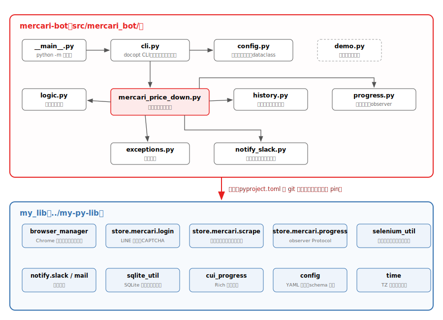
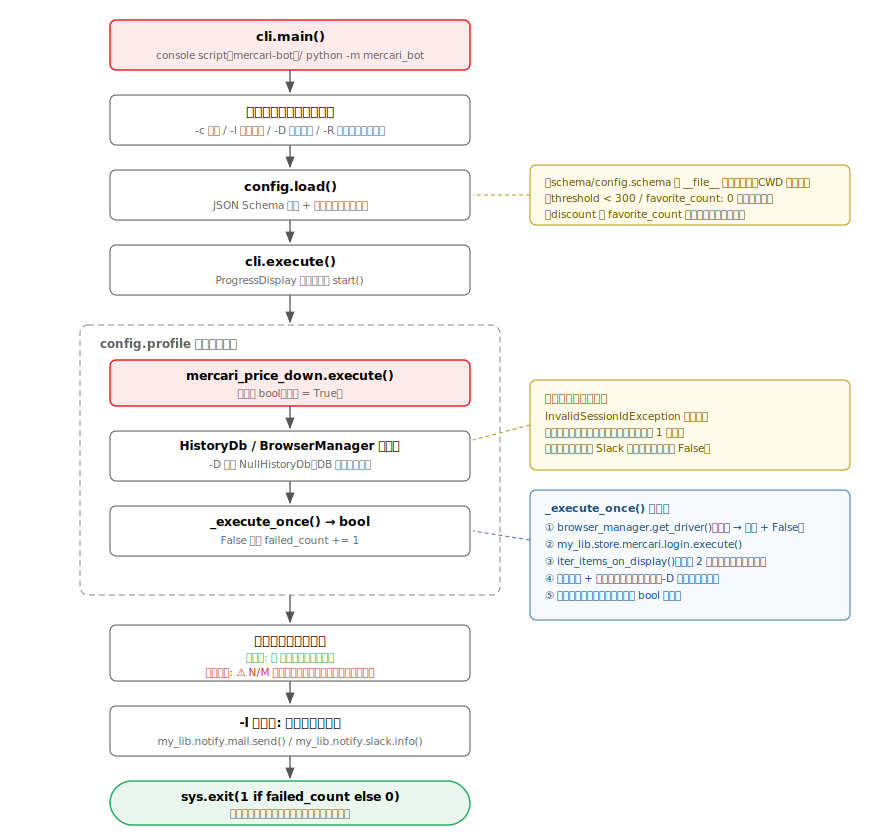
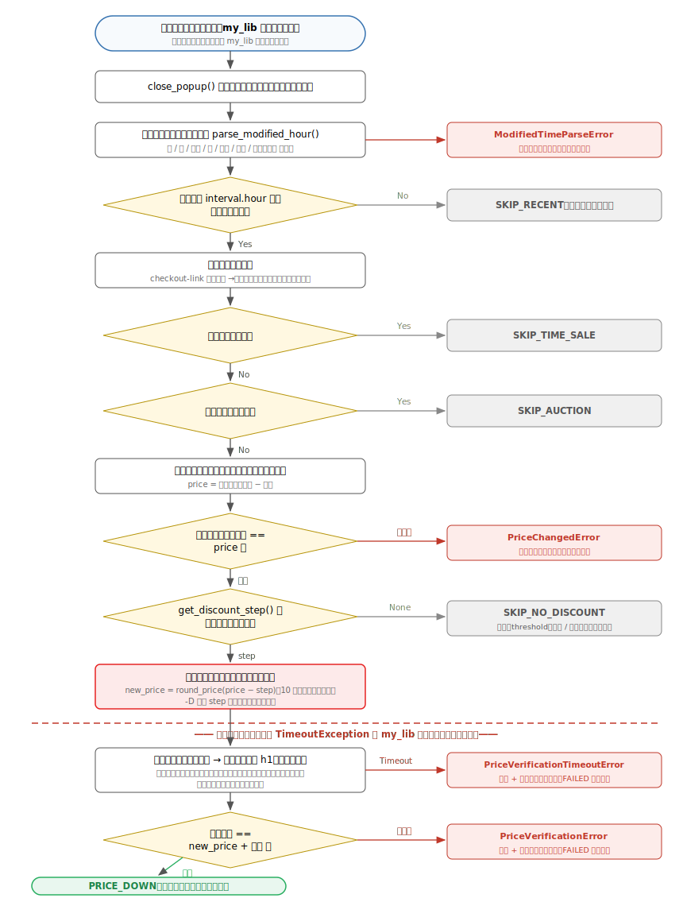
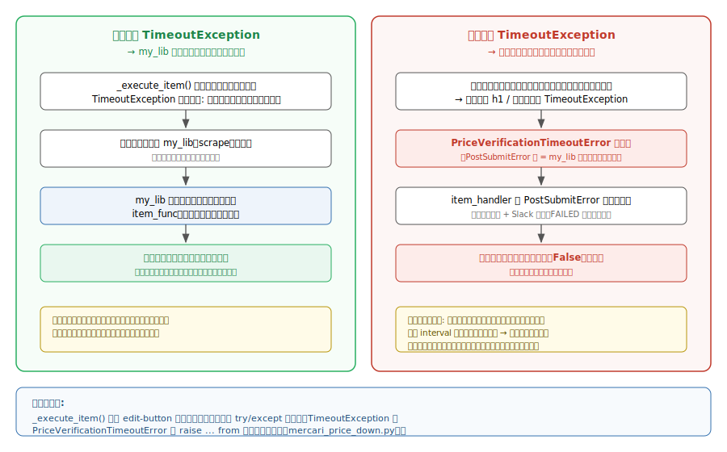
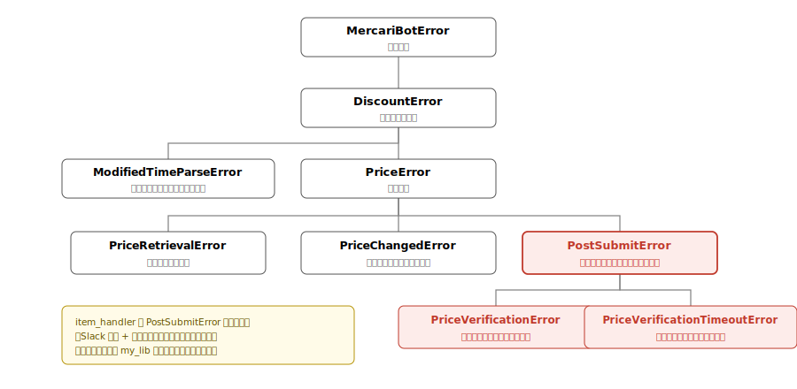
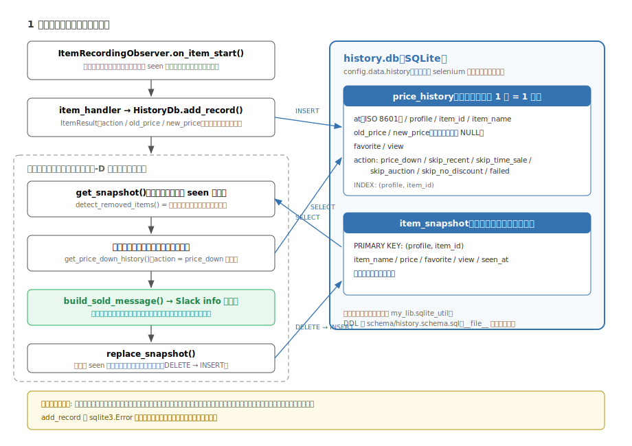
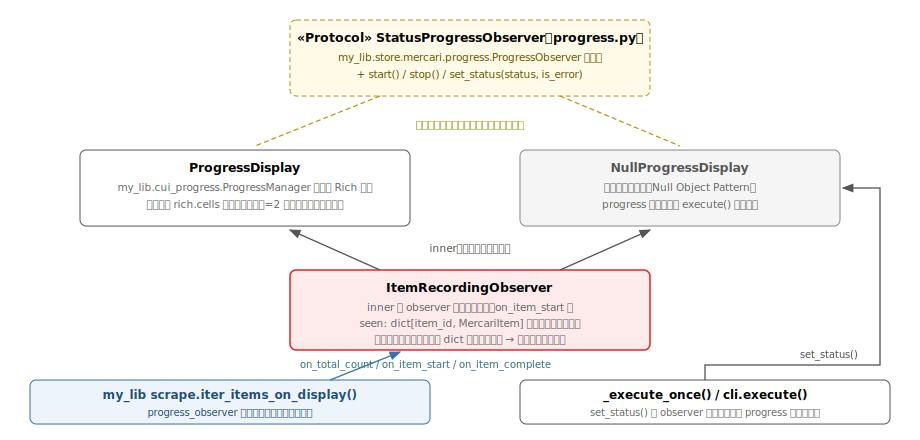

# mercari-bot アーキテクチャ

mercari-bot は、メルカリに出品中のアイテムの価格を自動的に値下げするボットです。
Selenium WebDriver でメルカリにログインし、お気に入り数と価格に応じた値下げを行い、
処理結果を SQLite に記録します。

本ドキュメントは `src/` 配下の実装に基づいてアーキテクチャを説明します。

## 目次

1. [モジュール構成](#モジュール構成)
2. [実行フロー全体](#実行フロー全体)
3. [アイテム 1 件の処理フロー](#アイテム-1-件の処理フロー)
4. [送信後エラーとリトライ制御](#送信後エラーとリトライ制御)
5. [例外階層](#例外階層)
6. [値下げ履歴と売却検知](#値下げ履歴と売却検知)
7. [進捗表示と observer 構成](#進捗表示と-observer-構成)
8. [設定管理](#設定管理)
9. [インフラ](#インフラ)
10. [テスト構成](#テスト構成)

## モジュール構成



アプリケーション本体は `src/mercari_bot/` の 8 モジュールで構成されます。
Selenium 操作の低レベル処理（ブラウザ起動、ログイン、アイテム列挙、リトライ制御）は
共通ライブラリ `my_lib`（`../my-py-lib`、`pyproject.toml` で git コミットハッシュを pin）に
委譲し、mercari-bot 側は「値下げの判断と実行」に集中する構成です。

| モジュール | 責務 |
| --- | --- |
| `cli.py` | docopt による CLI（`-c` / `-l` / `-D` / `-R`）。プロファイルを巡回し、失敗数から終了コードを決定 |
| `config.py` | `config.yaml` の読み込みと frozen dataclass への変換（`AppConfig` / `ProfileConfig` / `DiscountConfig` / `IntervalConfig` / `DataConfig`）。運用ミスの警告も担当 |
| `mercari_price_down.py` | 値下げ処理の中核。ブラウザ管理・ログイン・アイテム走査の呼び出しと、アイテム毎の値下げ実行（`_execute_item()`） |
| `logic.py` | Selenium に依存しない純粋ロジック。`parse_modified_hour()` / `get_discount_step()` / `round_price()` |
| `history.py` | 値下げ履歴の SQLite 記録（`HistoryDb`）と売却検知の純粋ロジック（`detect_removed_items()` / `build_sold_message()`） |
| `progress.py` | Rich による進捗表示（`ProgressDisplay`）、Null Object（`NullProgressDisplay`）、全アイテム捕捉用ラッパー（`ItemRecordingObserver`） |
| `notify_slack.py` | ページダンプ・スクリーンショット付きの Slack エラー通知（`dump_and_notify_error()` ほか） |
| `exceptions.py` | 例外階層の定義 |

`src/demo.py` は Selenium をモックして進捗表示などを確認するためのデモスクリプトで、
本体の処理フローには関与しません。

### コーディング上の方針（実装に現れているもの）

- 設定・データ構造はすべて `@dataclass(frozen=True)`
- モジュールは `import xxx` で取り込み完全修飾名で参照（dataclass・型のみ `from ... import` 可）
- 「何もしない」実装が必要な箇所は Null Object Pattern（`NullProgressDisplay` / `NullHistoryDb`）

## 実行フロー全体



エントリポイントは console script `mercari-bot`（= `mercari_bot.cli:main`）です。
`python -m mercari_bot`（`__main__.py`）からも同じ `main()` に到達します。

1. **引数解析・ロガー初期化** — docopt でオプションを解析。`-D` 時はログレベルが DEBUG になり、
   TTY 環境では Rich 表示と干渉しないシンプルなログフォーマットを使います。
2. **設定読み込み** — `config.load()` が YAML を JSON Schema（`schema/config.schema`）で検証して
   `AppConfig` を構築します。スキーマパスは `cli.py` で `__file__` 基準に解決するため、
   カレントディレクトリに依存しません。
3. **プロファイル巡回** — `cli.execute()` が `config.profile` 毎に
   `mercari_price_down.execute()`（戻り値 `bool`）を呼び、失敗数を数えます。
4. **セッションリトライ** — `mercari_price_down.execute()` は
   `InvalidSessionIdException`（ブラウザクラッシュ等）を捕捉すると、プロファイルをクリアした
   `BrowserManager` を再生成して 1 回だけ再試行します（`_MAX_RETRY_COUNT = 1`）。
   それでも失敗した場合は Slack にエラー通知して `False` を返します。
5. **結果表示と終了コード** — 全プロファイル成功なら「🎉 全プロファイル完了」、
   失敗があれば「⚠️ N/M プロファイルでエラーが発生しました」を表示し、
   `sys.exit(1 if failed_count else 0)` で終了します。
   `-l` 指定時は実行ログ全文を `my_lib.notify.mail.send()` と `my_lib.notify.slack.info()` で送信します。

`_execute_once()`（1 プロファイル 1 回分）の内部では、ログイン
（`my_lib.store.mercari.login.execute()`、LINE 認証・CAPTCHA 対応は my_lib 側）ののち、
`my_lib.store.mercari.scrape.iter_items_on_display()` に `item_handler` を渡してアイテムを走査します。
アイテム単位の処理が **2 回連続で失敗**すると走査を中断します
（`max_consecutive_failures=_MAX_CONSECUTIVE_ITEM_FAILURES`。連続失敗はサイト構造の変化を示唆するため）。
ブラウザ起動失敗・ログイン失敗・その他の例外はいずれも `dump_and_notify_error()` で
Slack 通知したうえで `False` を返し、後続プロファイルの処理は継続されます。

## アイテム 1 件の処理フロー



`_execute_item()`（`mercari_price_down.py`）はアイテム 1 件を処理し、結果を
`ItemResult`（`history.py` の frozen dataclass。`action` / `old_price` / `new_price`）で返します。
スキップ理由はすべて `ItemAction` enum で表現され、履歴 DB に記録されます。

判断に使う値：

- **更新経過時間** — `logic.parse_modified_hour()` が「◯秒前 / 分前 / 時間前 / 日前 / 週間前 /
  か月前 / 半年以上前」を時間単位に変換。`profile.interval.hour` 未満なら `SKIP_RECENT`
- **値下げ幅** — `logic.get_discount_step()` が `profile.discount`
  （設定読み込み時に `favorite_count` 降順ソート済み）を先頭から評価し、
  お気に入り数が条件を満たす最初のルールを採用。
  値下げ後価格（`round_price()` で 10 円単位に切り捨て）が `threshold` を下回る場合や、
  どの条件にも合致しない場合は `None` → `SKIP_NO_DISCOUNT`
- **送料** — 梱包・発送たのメル便の場合は編集フォームの送料表示を取得し、
  「一覧の表示価格 − 送料」を出品価格として扱います。検証時は逆に送料を足し戻して比較します

価格入力は React の controlled input に対応するため、`nativeInputValueSetter` で値を設定して
`input` / `change` イベントを発火する JavaScript 実行で行います。

`-D`（デバッグモード）では値下げ幅を適用せず**同額**を送信します（値下げは発生しません）。
また my_lib 側が 1 アイテムで走査を打ち切ります。

## 送信後エラーとリトライ制御



my_lib の `scrape` はアイテム処理中の `TimeoutException` /
`ElementNotInteractableException` を捕捉し、商品ページを開き直して item_func を再実行する
リトライ制御を持っています。これは**送信前**の失敗に対しては安全ですが、
**送信後**（「変更する」ボタンのクリック以降）の失敗に対しては危険です：

> 送信は成功しているため、リトライで再実行すると商品の更新時間が「数秒前」になっており、
> interval 判定で**正常スキップ**される。結果、価格検証が一度も行われないまま
> 成功扱いになってしまう。

このため `_execute_item()` は edit-button クリック以降を try/except で囲み、
`TimeoutException` を `PriceVerificationTimeoutError` に変換します。
この例外は my_lib のリトライ対象外なので `item_handler` まで伝播し、
`PriceVerificationError`（検証で価格不一致）と共通の親クラス `PostSubmitError` として捕捉されて
「ページダンプ + Slack 通知 + プロファイル失敗 + `FAILED` を履歴に記録」で終了します。
アイテム走査自体はその後も継続します。

## 例外階層



`exceptions.py` に定義された例外はすべて `MercariBotError` を頂点とする階層に属します。
`PostSubmitError` は「送信済みでありリトライしてはいけない」という意味論を型で表現する
中間クラスで、`item_handler` はこのクラス 1 つを捕捉すれば送信後エラーを網羅できます。

| 例外 | 発生箇所 | リトライ可否 |
| --- | --- | --- |
| `ModifiedTimeParseError` | 更新時間テキストのパース失敗（`logic.py`） | my_lib のリトライに乗る |
| `PriceRetrievalError` | 価格入力欄の value 取得失敗 | 同上 |
| `PriceChangedError` | ページ遷移中に価格が変更された | 同上 |
| `PriceVerificationError` | 検証で価格が不一致 | **不可**（通知して失敗扱い） |
| `PriceVerificationTimeoutError` | 送信後の検証タイムアウト | **不可**（通知して失敗扱い） |

## 値下げ履歴と売却検知



`history.py` はアイテム毎の処理結果と出品一覧のスナップショットを SQLite に保存します。
DB ファイルは `config.data.history`（設定省略時は `data.selenium` ディレクトリ配下の
`history.db`）で、接続とスキーマ初期化には `my_lib.sqlite_util` を使用します
（DDL は `schema/history.schema.sql`）。時刻は `my_lib.time.now()` の ISO 8601 文字列です。

- **記録** — `item_handler` が `_execute_item()` の戻り値（または `PostSubmitError` 時の
  `FAILED`）を `HistoryDb.add_record()` で `price_history` テーブルに挿入します。
  記録失敗（`sqlite3.Error`）はログに留め、値下げ処理自体は止めません。
- **全アイテムの捕捉** — my_lib は公開停止中（`is_stop != 0`）のアイテムを item_func に
  渡さないため、スナップショットには `ItemRecordingObserver.on_item_start()` で捕捉した
  全アイテムを使います（observer は is_stop 判定より前に呼ばれます）。
- **売却検知** — 走査が正常完了した場合のみ、前回スナップショット（`get_snapshot()`）と
  今回の出現アイテムを `detect_removed_items()` で比較し、消えたアイテムを
  「売却または取り下げ」として値下げ履歴付きのサマリー（`build_sold_message()`）を
  `my_lib.notify.slack.info()` でプロファイル毎に 1 通通知します。
  その後 `replace_snapshot()` でスナップショットを全置換します。

フェイルセーフ：

- 初回実行はスナップショットが空のため通知されない
- 走査が例外で中断した場合はスナップショットを更新しない（次回の誤検知を防止）
- `-D` 時は `NullHistoryDb` が使われ、記録・検知とも行われない

## 進捗表示と observer 構成



進捗表示は 2 系統のインターフェースで構成されます。

- **my_lib 側の Protocol**（`my_lib.store.mercari.progress.ProgressObserver`）—
  `on_total_count()` / `on_item_start()` / `on_item_complete()` の 3 メソッド。
  `iter_items_on_display()` が走査中に呼び出します。
- **mercari-bot 側の Protocol**（`progress.StatusProgressObserver`）— 上記を継承し、
  `start()` / `stop()` / `set_status()` を追加した Protocol。
  `mercari_price_down.execute()` の `progress` 引数の型として使われます。

実装クラスは `ProgressDisplay`（TTY では `my_lib.cui_progress.ProgressManager` による
Rich 表示、非 TTY では logging にフォールバック）と `NullProgressDisplay` の 2 つで、
どちらも構造的に Protocol を満たします（`# type: ignore` は不要）。
商品名のトリミングは `rich.cells.cell_len()` / `set_cell_size()` による**表示幅（セル数）**基準で、
全角文字を 2 セルとして計算します。

`iter_items_on_display()` へは `ItemRecordingObserver` が渡されます。これは内側の observer に
すべて委譲しつつ、`on_item_start()` で全アイテムを `seen` に記録するラッパーで、
売却検知（前節）の入力になります。

## 設定管理

設定は YAML（`config.yaml`）+ JSON Schema（`schema/config.schema`）で、
`config.load()` が以下を行います。

1. `my_lib.config.load()` で YAML 読み込みとスキーマ検証
   （`step` / `threshold` / `interval.hour` は `minimum: 1`、`favorite_count` は `minimum: 0`）
2. frozen dataclass への変換。`discount` は `favorite_count` **降順にソートして格納**するため、
   `get_discount_step()` は先頭から最初にマッチした条件を使うだけでよい
3. 運用ミスの警告ログ（`_warn_profile_misconfiguration()`）
    - `threshold < 300`（メルカリの最低出品価格）— 値下げ後価格が 300 円を下回ると
      送信が失敗し続けるため
    - `favorite_count: 0` のデフォルト条件が無い — 大半のアイテムがスキップされるため

相対パス（`data.selenium` / `data.dump` / `data.history`）は
`my_lib.config.resolve_path()` により **config.yaml の場所を基準**とした絶対パスに解決され、
`DataConfig` には `pathlib.Path` として格納されます。

```yaml
profile:
    - name: Profile 1
      user: メルカリのユーザ ID
      pass: メルカリのパスワード
      line: { user: LINE ユーザ ID, pass: LINE パスワード }
      discount:
          - { favorite_count: 10, step: 200, threshold: 3000 }
          - { favorite_count: 0, step: 100, threshold: 3000 }
      interval: { hour: 20 }
data:
    selenium: ./data
    dump: ./data/debug
    # history: ./data/history.db  # 省略時は selenium 配下の history.db
```

Slack（info / captcha / error チャンネル）とメール（SMTP）の通知設定はオプションで、
省略時は `SlackEmptyConfig` / `MailEmptyConfig` により通知が無効化されます。

## インフラ

### Docker

- ベースイメージ: `ubuntu:24.04`（Python イメージでは Selenium の同時実行に問題があるため）
- Google Chrome（stable の最新版）と日本語フォント・ロケール（`Asia/Tokyo`）を同梱
- パッケージ管理は `uv`（`uv sync --locked`）
- `ENTRYPOINT ["tini", "--", "uv", "run", "--no-group", "dev"]` + `CMD ["mercari-bot", "-l"]`

### Kubernetes

`kubernetes/mercari-bot.yaml` に CronJob として定義されています。

| 項目 | 値 |
| --- | --- |
| namespace | `bot` |
| schedule | `0 7,18 * * *`（Asia/Tokyo、1 日 2 回） |
| データ永続化 | PVC `pvc-bot-mercari-inventory-control` を `/opt/mercari-bot/data` にマウント（Chrome プロファイル・履歴 DB がここに載る） |
| /dev/shm | `emptyDir`（Memory、2Gi）— Chrome のメモリ用 |
| リソース | requests 1Gi / limits 8Gi |

終了コードが非ゼロ（一部プロファイル失敗）の場合、CronJob の失敗として検知されます。

## テスト構成

```
tests/
├── conftest.py           # 共通 fixture（profile_config, app_config, mock_driver 等）
├── test_typecheck.py     # mypy を subprocess で実行する型チェックテスト
└── unit/
    ├── test_app.py               # cli.execute のフロー（mercari_price_down はモック）
    ├── test_config.py            # 設定パース・ソート・警告・スキーマ検証
    ├── test_demo.py              # demo.py の実行
    ├── test_history.py           # HistoryDb（実 SQLite / tmp_path）・売却検知ロジック
    ├── test_logic.py             # parse_modified_hour / get_discount_step / round_price
    ├── test_mercari_price_down.py # _execute_item の各分岐・リトライ・売却検知の統合
    ├── test_notify_slack.py      # 通知（ダンプ・スクリーンショット）
    └── test_progress.py          # 進捗表示・トリミング・ItemRecordingObserver
```

- Selenium・Slack API・my_lib のブラウザ操作は `unittest.mock` でモックし、
  処理フロー（分岐・例外変換・通知・記録）を検証する方針
- `HistoryDb` のテストのみ `tmp_path` 上の実 SQLite を使用
- E2E テストはデフォルトで除外（`pyproject.toml` の `--ignore=tests/e2e`）
